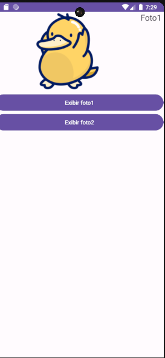

# VIZUALIZADOR DE IMAGENS

## SOBRE O PROJETO
- Esse projeto foi pensando para treinar os comandos de mobile, sendo ultilizado com a turma do técnico do CSL.

## LAYOUT DE TELAS
### Tela 1

### Tela 2

### TECNOLOGIAS ULTILIZADAS
- Android Studios

### BACKEND
- Java(mobile)

### FRONTEND
- XML(Activity)

### IDE
- Android Studios

### APK DO PROJETO
https://drive.google.com/file/d/1tRbbUhBGFNXffUqPsmKy707MsQ4g0tXH/view?usp=share_link LINK PARA DOWNLOAD DO VISUALIZADOR DE IMAGENS 

### COMO INSTALAR
- 1° Acesse o link
  
- 2° Acesse o arquivo do link

- 3° Clique em instalar
Após isso so testar

### PRÉ REQUISITOS
- Android 8.0

## CRÉDITOS
Feito por Felipe Sampaio  | 
https://github.com/felipeCsampaio LINK DO PROFILE DE FELIPE SAMPAIO
